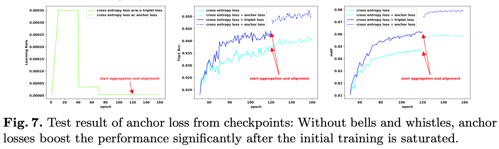
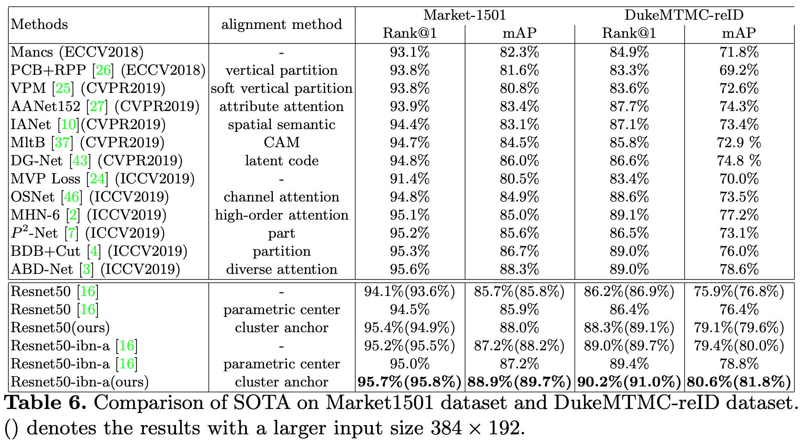
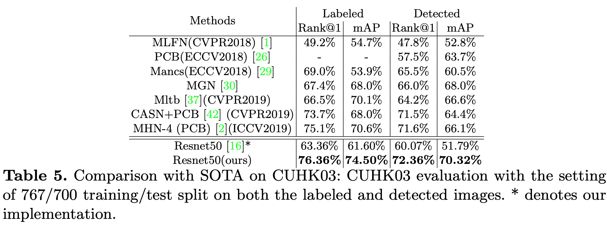
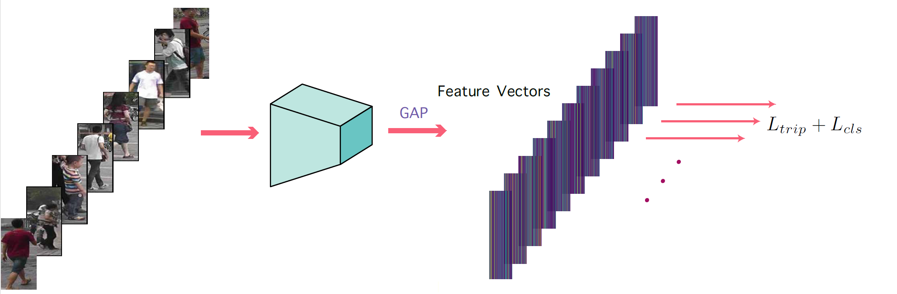
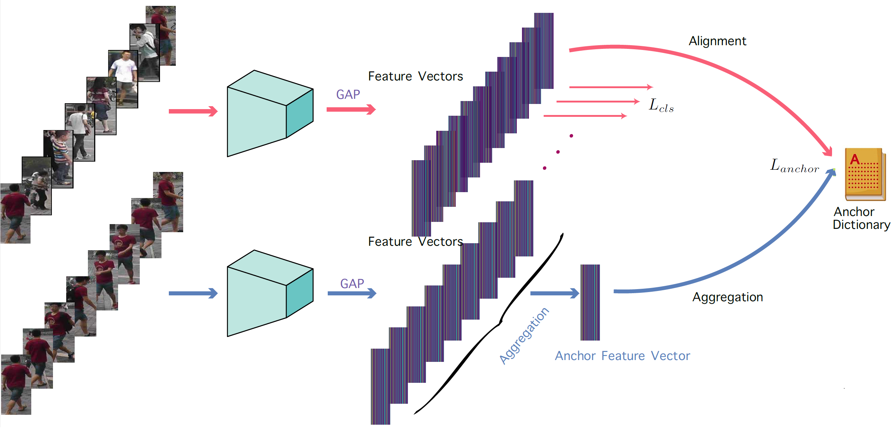

# Cluster-Level Feature Alignment for Person Re-Identificaiton

The proposed anchor loss is simple and highly effective with additional serveral epochs fine-tuning after traditional training stage and brings sigfinicant performance boost. It achieves state-of-the-art based on a simple and strong baseline, [Bag of Tricks and a Strong Baseline for Deep Person Re-Identification](https://openaccess.thecvf.com/content_CVPR_2019/papers/Wang_Ranked_List_Loss_for_Deep_Metric_Learning_CVPR_2019_paper.pdf). Check out our [technical report](https://arxiv.org/abs/2008.06810) for more details.



If you find the technical report or repository is useful, please kindly cite:
```
@article{chen2020cluster-reid,
  title={Cluster-level Feature Alignment for Person Re-identification},
  author={Chen, Qiuyu and Zhang, Wei and Fan, Jianping},
  journal={arXiv preprint arXiv:2008.06810},
  year={2020}
}

```


## Highlight
### Support Models

* [Person reid baseline pytorch](https://github.com/layumi/Person_reID_baseline_pytorch)
* [Bag of tricks and a strong ReID baseline](https://github.com/michuanhaohao/reid-strong-baseline)
* [MGN](https://github.com/seathiefwang/MGN-pytorch)
* [ABD-Net](https://github.com/VITA-Group/ABD-Net)


### Suport Datasets

* Market1501
* DukeMTMC
* CUHK03

### Features
* Tensorboard visiualization
* Fast inference and validation after every training epoch

## Setup/Prerequesite
```
pip install -r requirements.txt
cd utils/rank_cylib
make all
cd ../../
```

### Pretrained Models

Download the [pretrained models](https://drive.google.com/file/d/1xUg4IuvBpKM6BrgYuh6-z3P9Ii3Pvcw2/view?usp=sharing) and place under the root directory of this project.

## Results





## Training

### Stage 1
This stage is identical to original training.


### Stage 2
An auxilary anchor loss is added to further fine-tune the model trained after stage 1.


### Market1501
| Train Script   |    Rank@1      |  mAP | Pretrained Model |
|--------- |:---------------:|-----:|-----------------:|
| scripts/trainval_market_bnneck.sh | 95.36% | 87.91% | pretrained_models/strong-baseline-market-bnneck-stage2/e159t30071.pth.tar |
| scripts/trainval_market_bnneck_ibn_a.sh | 95.67% | 89.53% | pretrained_models/strong-baseline-duke-bnneck-ibn-a-stage2/e139t32279.pth.tar |

### DukeMTMC
| Train Script   |    Rank@1      |  mAP | Pretrained Model |
|--------- |:---------------:|-----:|-----------------:|
| scripts/trainval_duke_bnneck.sh | 89.14% | 79.48% | pretrained_models/strong-baseline-duke-bnneck-stage2/e159t37434.pth.tar |
| scripts/trainval_duke_bnneck_ibn_a.sh | 91.11% | 81.84% | pretrained_models/strong-baseline-duke-bnneck-ibn-a-stage2/e139t32279.pth.tar |


## References

Some parts of this repo is taking code repositories beblow as references:

- [Bag of Tricks and A Strong ReID Baseline](https://github.com/michuanhaohao/reid-strong-baseline)
- [Person_reID_baseline_pytorch](https://github.com/layumi/Person_reID_baseline_pytorch)
- [Torchreid](https://github.com/layumi/Person_reID_baseline_pytorch)

Hugh thanks to the code maintainers of the above repositories.